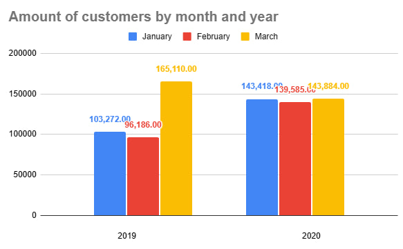

# Project 1 - Bicycles

## Scenario

We have marketing analyst team at Cyclistic, a bike-share
company in Chicago. And the director of marketing believes the company’s future success depends on maximizing the number of annual memberships. Therefore, team wants to understand how **casual riders** and **annual members** use Cyclistic bikes differently. From these insights, team will design a new marketing strategy to convert casual riders into annual members. But first, Cyclistic executives must approve your recommendations, so they must be backed up with compelling data insights and professional data visualizations.

## Step 1 - Ask questions

1. How do annual members and casual riders use Cyclistic bikes differently?
2. Why would casual riders buy Cyclistic annual memberships?
3. How can Cyclistic use digital media to influence casual riders to become members?

*Main question can be:* What company have to consider to influence casual riders to become members?

## Step 2 - Prepare data

I will evaluate data that is given to me and choose tools for process step.
This step includes next questions:

1. How is data organized?
2. How data will help answer questions?
3. Are there any problems with the data?

For now i have two data sets years 2019 and 2020, that tell me data about trip's time, station's name where trip was started and finished, customer's type - member or casual, customer's gender, birthyear and bike type.

## Step 3 - Process

In this step i will sort, filter and clean the data. Also check for any errors and try to fix them if needed.

Firstly i will use **Spreadsheet** check the data of both years and count trip's length and trip's weekday for connecting this information and comparing it by customer type.

### For this step I will use **Spreadsheet** to sort and filter data

## Step 4 - Analyze

Includes questions:

1. What trends or relationships i found in the data?
2. How these trends will help me answer my questions?

## In this step i will use also **Spreadsheet** to

- Calculate the *maximum* and *mean* of ride length.
- Calculate the *mode* of weekday.
- Create a pivot table to quickly calculate and visualize the data (Average) and - calculate the number of rides for users by weekday

### Results

**Data 2019**

- Max of trip length - 2953h 20min 22hsec
- Mean of trip length - 0h 16min 56h
- Mode of weekday - Thursday
  
**Data 2020**

- Max of trip length - 2607h 30min 24sec
- Mean of trip length - 0h 22min 07hsec
- Mode of weekday - Tuesday

## After that i will use **SQL** to find

- *Connect* both data sets and see how many people includes the data
- Explore *minimum, maximum and mean* of both table
- Create *summary* statistics
- Investigate some trends

### Results

- Customers totally - 365069 persons
- Usual customer - 23163
- Member customer - 341906
- Max of trip length - 2953h 20min
- Min of trip length - 0h 01min
- Mean of trip length - 0h 17min

*Average trip length by usertype:*

- Usual customer - 1h 25min
- Member customer - 0h 13min
  
*Average weekday by usertype:*

- Usual customer - Wednesday
- Member customer - Thursday
  
*Average start time by usertype:*

- Usual customer - 2.01pm
- Member customer - 1.12pm

## Step 5 - Share

In this step i will make summary of my work and visualize it.
Includes questions:

1. What story my data really tell?
2. How do my findings relate to my original questions?
3. Does my visualization correctly can explain my findings and answers?

Here i will use **R** because of big amount of data i can't make any visualizations in spreadsheets, so it will be easier to use R.
I will create table for visualization and write about the most important findings.

- I made bar chart table, which shows how many trips were made by usertype totally by month in both years.
  
Also I will use **Spreadsheets** to make some graphics.

- I made one pie chart, which displays amount of customers totally by usertype and bar chart which shows amount of customers by month and year, not including usertype.

## Step 6 - Act

My final conclusion and presentation to the team.
I have to answer main questions and explain them. Also explain what next steps can be based on my findings and is there additional data and questions for future i can use in the future (surely if is it needed)

### Findings

1. Most customers were members, they make up **93.7% of all customers.** 

2. Most popular month is **March** for both **members** and **casual customers**.

3. Second most popular month is **January** - about **100 000 member customers** and approximately **5 000 casual customers** used bicycles for trips. 

4. **2019** had more variation between months, not taking usertype into account. **Record amount was made at march of 2019 - 165 110 customers in total**, but in **January - 103 272** and in **February - 96 186**. 

4. During **2020** amount of customers was similar across all months, **January - 143 418, February - 139 585 and in March - 143 884.**

5. During **2019 the most popular weekday** for making trips was **Thursday**, but in **2020 - Tuesday**.

6. **Average** trip length in **2019 was 16 minutes**, while in **2020** this number was increased to **22 minutes**. 

7. **Average** trip length over both years by usertype is - **member - 13 minutes** and **usual customer - 1 hour and 25  minutes**.

8. Usually **member customer** prefers to rent a trip at about **1pm**, while **usual customer - at 2pm**

### Conclusion

With this in mind, I can answer the main question - How do annual members and casual riders use Cyclistic bikes differently?
- Trip length and weekday preference are the main differences between annual members and casual riders. 

My recommendations to the team for increasing member's amount:
1.  Company need collect more data, not only about data and time, but maybe about prices, and at least get data, that includes whole year statistics, not only January-March period, to make reliable and actual conclusion.
2.  Also the data that was given to me includes stop station's name, and customer's gender, that can be used in the future too, surely. 
To understand whish stations are the most popular and increase amount of bikes there. 
3. Search for events and collaborate with companies that organize them, suggest bike service to clients and make them some discount.
4. Use marketing strategies and discounts - for example, if clients purchase a three-month service package they get a cheaper offer.
5. Use information about gender: for example, make different types of bike, differently for women and men, that make customer feel more comfortable (colors, physics comfort, size).
5. Also company can offer to customers some equipment. For example GPS or helmet or digital equipment, like AI detectors, for following routes where people usually ride or make support chat, if somebody has a question or problem. 

### Links to Excel

1. [Trips made in 2019](https://docs.google.com/spreadsheets/d/1MEXQ_LBFf0TwIeriK8xKO6pmEHnBJY3MIDDwT1op_YE/edit?gid=797951180#gid=797951180)

2. [Trips made in 2020](https://docs.google.com/spreadsheets/d/1h-F8kwbz_W4l2HbzFt76WqZjcdqmxMi_HOMoGQPCTE8/edit?gid=640449855#gid=640449855)
